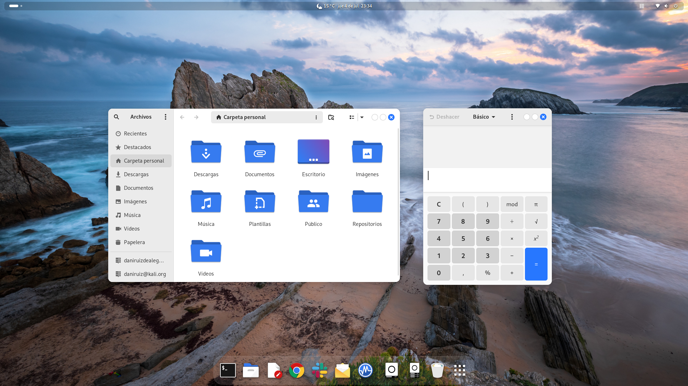
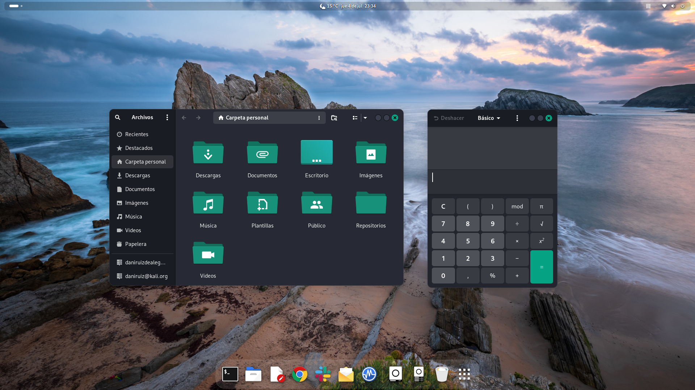
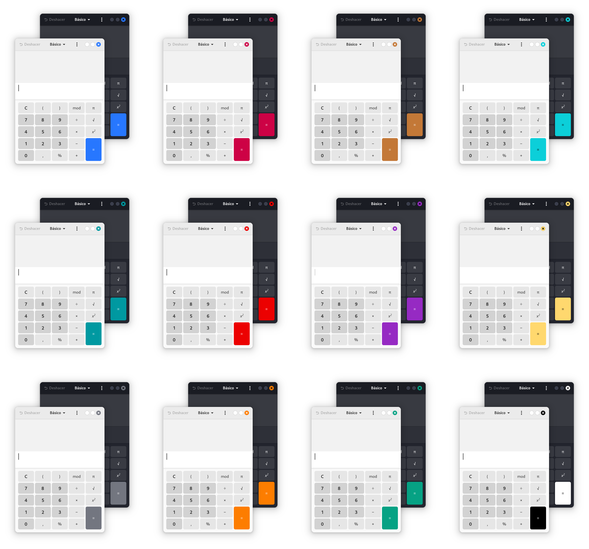

# GNOME 4X themes

_GNOME 4X Themes_ is a project dedicated to customizing the GNOME desktop environment starting from version 40. It offers custom colors and additional tweaks to enhance the user experience. The project supports themes for GTK-4, including Libadwaita, as well as GTK-3.

Themes are based on libadwaita and [adw-gtk3](https://github.com/lassekongo83/adw-gtk3) code.

**Features:**

- Dark & Light theme variants
- 12 color variants
- Rounded bottom corners hack for GTK-3 apps
- Custom close/minimize/maximize buttons

